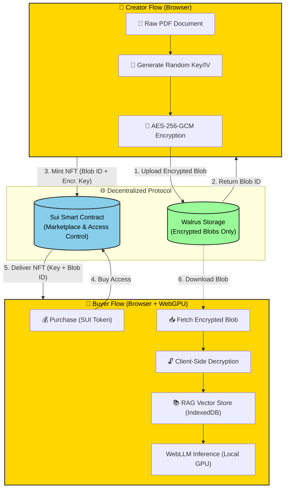

<div align="center">

#  GhostContext

## The First **WebLLM-Powered** Dentralized Marketplace for Private AI Knowledge

[](https://ghost-context-1.vercel.app)
[](https://youtu.be/vTgKUXxiHfk?si=Ln2SE9d5Ri8yAdCN)
[](https://sui.io)
[](https://walrus.site)
[](./LICENSE)


*Monetize sensitive documents without ever revealing the raw file to a server.*

[Features](#-features) • [Demo](#-live-demo) • [Architecture](#-architecture) • [Quick Start](#-quick-start) • [Tech Stack](#-tech-stack)

</div>

---

## The Problem

*Companies can't upload secrets to ChatGPT. Experts can't sell knowledge without piracy.*

- *Enterprises* have sensitive documents (contracts, research, internal memos) but can't use AI tools due to privacy concerns
- *Knowledge workers* want to monetize their expertise but fear piracy and unauthorized distribution
- *Current solutions* require trusting centralized servers with your most valuable data

*GhostContext solves both.*

---

## The Paradigm Shift

> *Instead of sending your private data to OpenAI, we download the AI model to your browser.*
> 
> *Your secrets never leave your device.*

We built the world's first *AI-powered decentralized knowledge marketplace* that combines *on-chain access control, **decentralized storage, and **client-side inference* to create a trustless data economy. Documents are encrypted locally, stored on Walrus, tokenized as NFTs on Sui, and queried using browser-based LLMs—enabling monetization without ever exposing plaintext to any server.

---

## ✅ The GhostContext Solution

<table>
<tr>
<td width="33%" align="center">

### Local Encryption

Files are encrypted *on the user's device* before going to Walrus.

*Plaintext never leaves the browser.*

</td>
<td width="33%" align="center">

### Token-Gated Access

Decryption rights are tied to *Sui NFTs*.

*No NFT → No decryption. Simple.*

</td>
<td width="33%" align="center">

### Client-Side RAG + Offline LLM

Documents are decrypted and processed *fully inside the user's browser* using a locally-run Llama-3 model.

*No internet required. No server inference. Zero data leakage.*

</td>
</tr>
</table>

---

## Why It's Different from "Just Running a Local LLM"

*Running a local LLM (like Ollama or LM Studio) is NOT the same as GhostContext.*

| Feature | Local LLM (Ollama/LM Studio) | GhostContext |
|---------|------------------------------|--------------|
| *Monetization* | ❌ No way to sell access to your documents | ✅ Built-in marketplace with NFT-based access control |
| *Access Control* | ❌ Anyone with the file can use it | ✅ Smart contract-enforced permissions (pay-per-query) |
| *Distribution* | ❌ Must manually share files (piracy risk) | ✅ Encrypted storage + on-chain keys (piracy-proof) |
| *Decentralization* | ❌ Files stored locally or on your server | ✅ Decentralized storage (Walrus) + blockchain (Sui) |
| *Revenue Tracking* | ❌ No built-in payment or analytics | ✅ On-chain revenue tracking and query limits |
| *Transferability* | ❌ Can't transfer ownership of documents | ✅ NFTs are tradeable, keys transfer automatically |
| *Discovery* | ❌ No marketplace or search | ✅ Browse and purchase from global marketplace |
| *Trust Model* | ❌ Requires trusting the file sender | ✅ Trustless: Verify encryption + access on-chain |

*In short: Local LLMs let you chat with YOUR documents privately. GhostContext lets you **monetize and trade* encrypted knowledge in a decentralized marketplace while maintaining the same privacy guarantees.

---

## Supported AI Models

GhostContext supports multiple state-of-the-art language models optimized for browser inference:

| Model | Size | Speed | Quality | Use Case |
|-------|------|-------|---------|----------|
| *Llama 3.2 1B* | ~1GB | ⚡ Fast | Good | Quick queries, mobile devices |
| *Llama 3.2 3B* | ~1.5GB | ⚡⚡ Medium-Fast | Very Good | Balanced performance |
| *Phi-3 Mini* | ~2GB | ⚡⚡ Medium | Good | Efficient reasoning |
| *Mistral 7B* | ~4GB | ⚡⚡⚡ Slower | Excellent | Complex analysis |
| *Qwen 2.5 1.5B* | ~1GB | ⚡ Fast | Good | Multilingual support |

*Engine Options*:
- *WebLLM (Standard)*: Original implementation with full compatibility
- *WeInfer (Optimized)*: ~3.76x faster with buffer reuse and memory optimization

*Hardware Requirements*:
- *Minimum*: 4GB RAM, Intel HD 5500+ / NVIDIA GTX 650+ / AMD HD 7750+
- *Recommended*: 8GB+ RAM, Modern GPU with WebGPU support
- *Browser*: Chrome 113+ or Edge 113+ with WebGPU enabled

---

## Features

### Home Dashboard
Central hub for accessing all GhostContext features with a clean, modern interface.

### AI Chat Interface
- *Local AI Models*: Run Llama-3, Phi-3, Mistral, and Qwen models directly in your browser
- *WebGPU Acceleration*: Hardware-accelerated inference for fast responses
- *WeInfer Optimization*: ~3.76x faster inference with buffer reuse
- *RAG Pipeline*: Retrieval-Augmented Generation for accurate document-based answers
- *Conversational Memory*: Context-aware multi-turn conversations
- *Source Citations*: Track which pages information comes from
- *Hybrid Search*: Semantic + keyword search for better retrieval

### Vault (Encryption & Minting)
- *Client-Side Encryption*: AES-256-GCM encryption in the browser
- *Walrus Upload*: Encrypted blobs stored on decentralized Walrus network
- *NFT Minting*: Create GhostContext NFTs with embedded encryption keys
- *Access Control*: Smart contract-based permission management
- *Listing*: Set price per query and list contexts for sale

### Marketplace
- *Browse Contexts*: Discover encrypted knowledge from other users
- *Category Filtering*: General, Technical, Research, Education
- *Purchase Queries*: Buy access to encrypted documents
- *Metrics Display*: View total queries sold and revenue
- *Modern UI*: Codeforces-style cards with gradients and animations

### My Purchases
- *Query Management*: Track remaining queries for purchased contexts
- *One-Click Load*: Decrypt and load purchased documents instantly
- *Blob ID Display*: Copy Walrus blob IDs for reference
- *Receipt NFTs*: On-chain proof of purchase with encryption keys

---

## Live Demo

### Deployed Application
Visit: [https://ghost-context-1.vercel.app](https://ghost-context-1.vercel.app)

### Video Walkthrough
Watch the full demo: [YouTube Demo](https://youtu.be/vTgKUXxiHfk?si=Ln2SE9d5Ri8yAdCN)

### Try It Yourself

1. *Connect Wallet*: Use Sui Wallet (Testnet)
2. *Select Engine*: Choose WebLLM or WeInfer
3. *Load Model*: Pick Llama-3.2 1B for fast inference
4. *Upload PDF*: Drop any document (100% local processing)
5. *Ask Questions*: Chat with your document using AI
6. *Encrypt & Mint*: Create an NFT and list it on the marketplace
7. *Purchase*: Buy access to other users' encrypted knowledge

---

## Why These Technologies?

### Why Sui?

*Sui is the only blockchain fast enough for real-time AI commerce.*

- ⚡ *Sub-Second Finality*: Instant NFT minting and purchases (400ms average)
- 💰 *Low Gas Fees*: Transactions cost <$0.01, making micro-payments viable
- 🎯 *Object-Centric Model*: Perfect for NFTs with embedded metadata (encryption keys)
- 🔐 *Move Language*: Memory-safe smart contracts prevent common vulnerabilities
- 📈 *Horizontal Scaling*: Can handle millions of users without congestion
- 🎫 *Programmable NFTs*: Dynamic access control and query tracking built-in

*Alternative blockchains* (Ethereum, Solana) either have:
- High gas fees (Ethereum: $5-50 per transaction)
- Network congestion issues
- Less flexible NFT standards

### Why Walrus?

*Walrus is the native decentralized storage layer for Sui, allowing us to bind Blob IDs directly to NFT Metadata objects efficiently.*

- 🔗 *Native Sui Integration*: Seamless blob storage with on-chain references
- 💾 *Cost-Effective*: ~$0.10 per GB vs. $5-20 on competitors
- 🌐 *Decentralized*: No single point of failure or censorship
- ⚡ *Fast Retrieval*: Content-addressed storage with CDN-like performance
- 🔒 *Immutable*: Once uploaded, blobs cannot be modified or deleted
- 📦 *Large File Support*: Handle documents up to 1GB+

*Why not IPFS/Arweave?*
- IPFS requires pinning services (centralization risk)
- Arweave is expensive for frequent updates
- Neither integrate natively with Sui's object model

### Encryption Strategy (Seal vs. Web Crypto)

*Seal enables policy-based encryption for enterprise use cases.*

- 🎯 *Policy-Based Access*: Define complex access rules (time-based, role-based)
- 🔐 *Attribute-Based Encryption*: Encrypt once, decrypt based on attributes
- 🏢 *Enterprise Ready*: Compliance with data governance requirements
- 🔄 *Key Rotation*: Update encryption without re-uploading data
- 👥 *Multi-Party Access*: Share with teams while maintaining control

*Current Implementation*: We use Web Crypto API (AES-256-GCM) for MVP simplicity.

*Future*: Seal integration will enable advanced features like:
- Time-locked documents (auto-expire after X days)
- Role-based access (only "researchers" can decrypt)
- Conditional access (require 2-of-3 signatures)

---

## Architecture



### Key Components

1. *Frontend (React + TypeScript)*
   - Modern UI with Tailwind CSS
   - WebGPU-accelerated AI inference
   - Client-side encryption/decryption

2. *Smart Contracts (Move on Sui)*
   - GhostContext NFTs with embedded keys
   - Query-based access control
   - Marketplace with revenue tracking

3. *Storage (Walrus)*
   - Decentralized blob storage
   - Encrypted document hosting
   - Content-addressed retrieval

4. *AI Engine (WebLLM)*
   - Browser-based LLM inference
   - RAG pipeline for document Q&A
   - Vector embeddings for semantic search

---


## Project Structure

```text
ghostcontext/
├── contracts/                    # Sui Move smart contracts
│   ├── source/
│   │   └── ghostcontext.move    # Main contract with NFT logic
│   ├── Move.toml                # Contract configuration
│   └── build/                   # Compiled contracts
│
├── src/
│   ├── components/              # React components
│   │   ├── Home.tsx            # Chat interface with RAG
│   │   ├── HomeNew.tsx         # Dashboard landing
│   │   ├── Vault.tsx           # Encryption & minting
│   │   ├── Marketplace.tsx     # Browse & purchase
│   │   ├── MyPurchases.tsx     # Manage bought contexts
│   │   ├── Navbar.tsx          # Navigation bar
│   │   ├── landingPage.tsx     # Public landing page
│   │   └── ui/                 # Reusable UI components
│   │       ├── Card.tsx
│   │       ├── Button.tsx
│   │       └── Input.tsx
│   │
│   ├── services/               # Core business logic
│   │   ├── rag-engine.ts       # RAG pipeline (WebLLM)
│   │   ├── rag-engine-weinfer.ts  # Optimized RAG (WeInfer)
│   │   ├── llm-client.ts       # LLM interface
│   │   ├── embedder.ts         # Text embedding
│   │   ├── vector-store.ts     # In-memory vector DB
│   │   ├── pdf-parser.ts       # PDF text extraction
│   │   └── ghostcontext-payload.ts  # Data serialization
│   │
│   ├── ghostcontext/           # Encryption & Walrus
│   │   ├── crypto.ts           # AES-256-GCM encryption
│   │   ├── walrus.ts           # Walrus API client
│   │   └── encryption-workflow.ts  # End-to-end flow
│   │
│   ├── hooks/                  # React hooks
│   ├── lib/                    # Utilities
│   ├── App.tsx                 # Main app component
│   ├── main.tsx                # Entry point
│   └── theme.css               # Global styles
│
├── scripts/                    # Deployment scripts
│   ├── deploy.ts              # Contract deployment
│   └── test-seal.ts           # Encryption testing
│
├── public/                     # Static assets
├── .env                        # Environment variables
├── package.json               # Dependencies
├── vite.config.ts             # Vite configuration
└── README.md                  # This file
```

---

## Tech Stack

### *Frontend*
- ⚛ *React 18* - UI framework
- 📘 *TypeScript* - Type safety
- 🎨 *Tailwind CSS* - Styling
- 🎭 *Framer Motion* - Animations
- 🧭 *React Router* - Navigation

### *AI & ML*
- 🤖 *WebLLM* - Browser-based LLM inference
- 🧠 *Transformers.js* - Text embeddings
- 🔍 *Custom RAG Pipeline* - Document Q&A
- 📊 *Vector Store* - Semantic search
- ⚡ *WebGPU* - Hardware acceleration

### *Blockchain*
- 🔷 *Sui Network* - Layer 1 blockchain
- 📜 *Move Language* - Smart contracts
- 🎫 *NFT Standard* - Token-gated access
- 💰 *SUI Token* - Payments

### *Storage & Encryption*
- 🐋 *Walrus* - Decentralized blob storage
- 🔐 *Web Crypto API* - AES-256-GCM encryption
- 🔑 *On-Chain Keys* - Secure key management

### *Development*
- ⚡ *Vite* - Build tool
- 📦 *pnpm* - Package manager
- 🧪 *TypeScript* - Type checking
- 🎯 *ESLint* - Code linting

---

## Quick Start

### Prerequisites

- *Node.js* 18+ and *pnpm*
- *Sui Wallet* (Browser extension)
- *Modern Browser* with WebGPU support (Chrome 113+, Edge 113+)

### Installation

```bash
# Clone the repository
git clone https://github.com/yourusername/ghostcontext.git
cd ghostcontext

# Install dependencies
pnpm install

# Set up environment variables
cp .env.example .env
# Edit .env with your Sui contract addresses

# Start development server
pnpm dev
```


### Environment Variables

```env
VITE_GHOSTCONTEXT_PACKAGE_ID=0x8ddf7cece3571b8758acbe667a8e2ddf8e0cef8e283a589459619b63fa4cb97a    # Deployed contract address
# View on Sui Explorer (testnet): https://explorer.sui.io/object/0x8ddf7cece3571b8758acbe667a8e2ddf8e0cef8e283a589459619b63fa4cb97a?network=testnet
VITE_GHOSTCONTEXT_REGISTRY_ID=0x...   # Registry object ID
VITE_WALRUS_PUBLISHER_URL=https://...  # Walrus publisher endpoint
VITE_WALRUS_AGGREGATOR_URL=https://... # Walrus aggregator endpoint
```


### Deploy Smart Contracts

```bash
cd contracts

# Build contracts
sui move build

# Deploy to Sui testnet
sui client publish --gas-budget 100000000

# Note the package ID and registry ID for .env
```


### Enable WebGPU (if needed)

1. Visit chrome://flags or edge://flags
2. Search for "WebGPU"
3. Enable "Unsafe WebGPU"
4. Relaunch browser

---

## Usage Guide

### 1️⃣ *Upload & Encrypt*

```typescript
// Upload a PDF document
const file = document.getElementById('fileInput').files[0];

// Encrypt locally (AES-256-GCM)
const { encryptedData, key, iv } = await encryptFile(file);

// Upload to Walrus
const blobId = await uploadToWalrus(encryptedData);
```


### 2️⃣ *Mint NFT*

```typescript
// Create GhostContext NFT with embedded keys
const tx = new Transaction();
tx.moveCall({
   target: `${packageId}::ghostcontext::create_context`,
   arguments: [
      tx.pure.string(title),
      tx.pure.string(blobId),
      tx.pure.string(key),
      tx.pure.string(iv),
      tx.pure.string(category),
      tx.object(registryId),
   ],
});
```


### 3️⃣ *List for Sale*

```typescript
// Set price per query (in MIST)
tx.moveCall({
   target: `${packageId}::ghostcontext::list_context`,
   arguments: [
      tx.object(contextId),
      tx.pure.u64(pricePerQuery),
   ],
});
```


### 4️⃣ *Purchase & Decrypt*

```typescript
// Buy queries
tx.moveCall({
   target: `${packageId}::ghostcontext::purchase_queries`,
   arguments: [
      tx.object(contextId),
      tx.pure.u64(queryCount),
      coin,
      tx.object(registryId),
   ],
});

// Decrypt with keys from receipt NFT
const decrypted = await decryptData(encryptedBlob, key, iv);
```


### 5️⃣ *Chat with AI*

```typescript
// Load document into RAG
await rag.ingest(decryptedFile);

// Ask questions
const answer = await rag.query(
   "What is this document about?",
   (partial) => console.log(partial) // Streaming
);
```

---

## Features in Detail

### 🔐 *Encryption Workflow*

1. *Client-Side Encryption*: Files are encrypted using AES-256-GCM before leaving the browser
2. *Random Key Generation*: Cryptographically secure random keys via Web Crypto API
3. *On-Chain Storage*: Encryption keys stored in NFT metadata for transferability
4. *Decryption on Purchase*: Buyers receive keys automatically via QueryReceipt NFT

### 🤖 *AI Engine*

- *Model Selection*: Choose from Llama-3, Phi-3, Mistral, Qwen
- *WebGPU Acceleration*: 10-100x faster than CPU inference
- *Streaming Responses*: Real-time token generation
- *RAG Pipeline*: Semantic search + LLM generation
- *Conversational Memory*: Multi-turn context awareness

### 🛒 *Marketplace*

- *Category Filtering*: Browse by General, Technical, Research, Education
- *Metrics Display*: Total queries sold, revenue earned
- *Purchase Modal*: Clean UI for buying queries
- *Real-time Updates*: Instant marketplace refresh after transactions

### 📊 *Analytics*

- *Query Tracking*: Monitor remaining queries per purchase
- *Revenue Dashboard*: Track earnings from listed contexts
- *Usage Metrics*: View total queries sold per context

---

## Security

- ✅ *Client-Side Encryption*: Data encrypted before upload
- ✅ *Zero-Knowledge*: Server never sees plaintext
- ✅ *On-Chain Access Control*: Smart contract-enforced permissions
- ✅ *Decentralized Storage*: No single point of failure
- ✅ *Local AI Inference*: Queries never sent to external servers
- ✅ *Auditable*: All transactions on-chain and verifiable

---

## Roadmap

### ✅ *Phase 1: MVP (Completed)*
- [x] Local encryption & Walrus upload
- [x] Sui smart contracts
- [x] WebLLM integration
- [x] Basic marketplace
- [x] NFT minting & trading

### 🚧 *Phase 2: Optimization (In Progress)*
- [ ] WeInfer optimization (3.76x faster)
- [ ] Improved vector search
- [ ] Better UI/UX
- [ ] Mobile responsiveness

### 🔮 *Phase 3: Advanced Features (Planned)*
- [ ] Multi-file contexts
- [ ] Collaborative contexts
- [ ] Revenue sharing
- [ ] Advanced analytics
- [ ] API access

### 🌟 *Phase 4: Ecosystem (Future)*
- [ ] GhostNodes (GPU rental)
- [ ] Decentralized training
- [ ] Cross-chain support
- [ ] Enterprise features

---

## Contributing

We welcome contributions! Please see our [Contributing Guide](CONTRIBUTING.md) for details.

### Development Setup

bash
# Fork and clone
git clone https://github.com/yourusername/ghostcontext.git

# Create a branch
git checkout -b feature/amazing-feature

# Make changes and commit
git commit -m "Add amazing feature"

# Push and create PR
git push origin feature/amazing-feature


---

## License

This project is licensed under the MIT License - see the [LICENSE](LICENSE) file for details.

---

## Acknowledgments

- *Sui Foundation* - Blockchain infrastructure
- *Walrus Team* - Decentralized storage
- *MLC Team* - WebLLM framework
- *Hugging Face* - Transformers.js
- *Open Source Community* - Amazing tools and libraries

---

## Contact

- *Website*: [https://ghost-context-1.vercel.app](https://ghost-context-1.vercel.app)
- *Twitter*: [@Riddhisen382324](https://x.com/Riddhisen382324?t=6JWANbEnHAy6Vl_iw0V3dQ&s=09)
- *Discord*: [Join our community](https://discord.gg/ghostcontext)
- *Email*: hello@ghostcontext.app

---

## Known Issues & Limitations

### Seal Integration Status

*Current Status*: ❌ Not Integrated (Using Web Crypto API instead)

*Why?*
We initially planned to use *Seal* (Sui's policy-based encryption framework) for advanced access control. However, we encountered several blockers:

#### *Issue #1: Policy Complexity*
- Seal requires defining complex policy objects on-chain
- Our use case (simple key-based encryption) doesn't need policy overhead
- Web Crypto API provides sufficient security for MVP

#### *Issue #2: Key Management*
- Seal's policy-based approach requires additional infrastructure
- Managing policy updates adds complexity for users
- Direct key storage in NFTs is simpler and more transparent

#### *Issue #3: Documentation & Examples*
- Limited production examples of Seal integration
- Unclear best practices for browser-based encryption
- Testnet stability issues during development

#### *Our Solution*
We implemented a *hybrid approach*:
- ✅ *AES-256-GCM* encryption (industry standard, battle-tested)
- ✅ *Keys stored on-chain* in NFT metadata (transparent, auditable)
- ✅ *Smart contract access control* (token-gated decryption)
- ✅ *Client-side processing* (zero-knowledge, privacy-preserving)

#### *Future Plans*
Once Seal matures and provides:
- Better documentation
- Browser-friendly SDKs
- Stable testnet/mainnet support

We will migrate to Seal for:
- 🎯 Time-locked documents
- 👥 Multi-party access control
- 🔄 Key rotation without re-upload
- 🏢 Enterprise compliance features

*Tracking Issue*: [#42 - Seal Integration](https://github.com/yourusername/ghostcontext/issues/42)

---

### Other Known Limitations

1. *Browser Compatibility*
   - Requires WebGPU support (Chrome 113+, Edge 113+)
   - Safari not yet supported (WebGPU in development)
   - Mobile browsers have limited support

2. *File Size Limits*
   - Recommended: <10MB PDFs for optimal performance
   - Large files may cause browser memory issues
   - Walrus supports up to 1GB, but browser processing is the bottleneck

3. *Model Loading Time*
   - First-time model download: 1-5 minutes (depending on model size)
   - Models cached locally after first load
   - Requires stable internet connection for initial download

4. *Testnet Limitations*
   - Using Sui Testnet (not production-ready)
   - Testnet tokens have no real value
   - Network may be reset periodically

---

## Future Improvements

### *Short-Term (Q1 2025)*
- [ ] Seal integration for advanced policies
- [ ] Mobile app (React Native)
- [ ] Safari/Firefox support
- [ ] Improved model caching

### *Medium-Term (Q2-Q3 2025)*
- [ ] Multi-file contexts
- [ ] Collaborative editing
- [ ] Revenue analytics dashboard
- [ ] API for developers

### *Long-Term (Q4 2025+)*
- [ ] GhostNodes (decentralized GPU rental)
- [ ] Cross-chain support
- [ ] Enterprise features
- [ ] Mainnet launch

---

<div align="center">

*Built with ❤ by the GhostContext Team*

*Founders*: Ankit & Rick

[⭐ Star us on GitHub](https://github.com/yourusername/ghostcontext) • [🐦 Follow on Twitter](https://x.com/Riddhisen382324?t=6JWANbEnHAy6Vl_iw0V3dQ&s=09) • [💬 Join Discord](https://discord.gg/ghostcontext)

</div>
